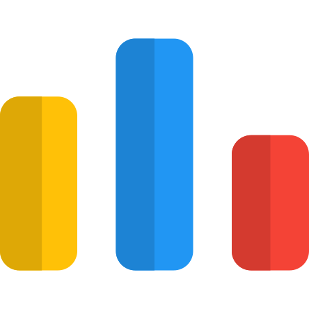

<table>
    <tr>
        
    </tr>
    <tr>
        <td>
            
        </td>
        <td>
            
        </td>
        <td>
            
        </td>
        <td>
            
        </td>
    </tr>
</table>

<table>
    <tr>
        <td>
            
        </td>
        <!-- <td> @to-consider
            
        </td> -->
        <td>
            <table>
                <tr>
                    <td>
                        
                    </td>
                    <td>
                        
                    </td>
                    <td>
                        
                    </td>
                    <td>
                        
                    </td>
                    <td>
                        
                    </td>
                    <td>
                        
                    </td>
                </tr>
            </table>
             
            <table align="right">
                <tr>
                    <td>
                        - Akshat Sood (asood-life)
                    </td>
                </tr>
            </table>
        </td>  
    </tr>
</table>

<!-- <footer> @footer-template
    If you find value in this project, please consider giving it a star ⭐ to show your support. Should you encounter any issues or have suggestions for enhancements, feel free to reach out to me or register them under the <a href="https://github.com/asood-life/asood-life/issues">Issues</a> section.
</footer> -->